# 🍃 leaf: Log Error & Anomaly Finder

# Under development

<div align="center">

[](https://www.rust-lang.org/)
[](https://kubernetes.io/)
[](https://opensource.org/licenses/MIT)

</div>

---

<div align="center">

### 🚀 **Intelligent Log Analytics for Kubernetes** 
**Clustering similar log lines using advanced Sorensen-Dice similarity**

*High-performance • Memory-efficient • Parallel processing • Smart filtering*

</div>

> 🎯 **Perfect for DevOps teams** analyzing thousands of log lines across multiple pods and containers. Leaf automatically groups similar logs together, helping you identify patterns, recurring issues, and anomalies in your Kubernetes cluster logs.

## ✨ Key Features

- **🔥 Fast Performance**: 1K logs (12ms), 10K logs (133ms), 50K logs (747ms)
- **🧠 Smart Filtering**: Auto-removes UUIDs, hashes, and random tokens
- **📊 Proven Scale**: Benchmarked up to 500K logs with 9 comprehensive test suites
- **🎯 High Accuracy**: Sorensen-Dice similarity with configurable thresholds (0.5-0.95)
- **🔧 Flexible Output**: Human-readable and JSON formats
- **⚡ Dynamic Memory**: Auto-sized string pools (4MB-2048MB based on data size)

---

## 📚 Table of Contents
- [🚀 Quick Start](#-quick-start)
- [⚡ Features](#-features)
- [🛠️ Installation](#️-installation)
- [📖 Usage](#-usage)
- [⚙️ CLI Options](#️-cli-options)
- [💡 Examples](#-examples)
- [🏗️ How It Works](#️-how-it-works)
- [⚡ Performance & Benchmarks](#-performance--benchmarks)
- [❓ FAQ](#-faq)
- [📄 License](#-license)

---

## 🚀 Quick Start

```bash
# Build the project
cargo build --release

# Cluster logs from default namespace
./target/release/leaf --namespace default

# Get JSON output with progress
./target/release/leaf --json --threshold 0.85
```

---

## ⚡ Features

| **Performance** | **Intelligence** | **Scalability** | **Usability** |
|:---------------:|:----------------:|:---------------:|:-------------:|
| Parallel processing | Nonsense-word filtering | Dynamic memory (4MB-2048MB) | Human & JSON output |
| Memory-mapped storage | Sorensen-Dice similarity | Benchmarked to 500K logs | Rich CLI options |
| Fast hash operations | Smart normalization | 9 benchmark suites | Kubernetes native |
| Batch processing | Configurable thresholds | Concurrent limits | Progress tracking |

---

## 🛠️ Installation

### Prerequisites
- Rust 1.70+ and Cargo
- Access to a Kubernetes cluster 
- Valid kubeconfig (leaf uses your current kubectl context)

### Build from Source
```bash
# Clone and build
git clone git@github.com:adsanz/leaf.git
cd leaf
cargo build --release

# Binary will be available at ./target/release/leaf
```

### Quick Test
```bash
# Test with current cluster
./target/release/leaf --namespace kube-system --member-limit 5 -j
```

---

## 📖 Usage

```bash
leaf [OPTIONS]
```

### 🔄 **Typical Workflow**

```mermaid
graph LR
    A[🎯 Target Pods] --> B[📥 Fetch Logs]
    B --> C[🔍 Filter Lines]  
    C --> D[🧹 Clean & Normalize]
    D --> E[🔗 Cluster Similar]
    E --> F[📊 Output Results]
```



1. **🎯 Target**: Select pods/containers via namespace/labels
2. **📥 Fetch**: Download logs in parallel with rate limiting  
3. **🔍 Filter**: Apply substring filters (optional)
4. **🧹 Normalize**: Extract and clean words, remove noise
5. **🔗 Cluster**: Group by Sorensen-Dice similarity 
6. **📊 Output**: Present as human-readable or JSON format

---

## ⚙️ CLI Options

| Option | Description | Example |
|:-------|:------------|:--------|
| `--namespace <NS>` | Target specific namespace | `--namespace production` |
| `--label <SELECTOR>` | Filter by pod labels | `--label app=nginx` |
| `--since <TIME>` | Logs since timestamp (human-readable or RFC3339) | `--since 1h` or `--since 2024-01-01T00:00:00Z` |
| `--filter <STRINGS>` | Include lines containing text | `--filter error,warning` |
| `--threshold <FLOAT>` | Similarity threshold (0.0-1.0) | `--threshold 0.9` |
| `--json` | Output as JSON format | `--json` |
| `--member-limit <N>` | Max logs per cluster (JSON) | `--member-limit 10` |
| `--fetch-limit <N>` | Concurrent pod fetches | `--fetch-limit 20` |
| `--batch-size-factor <N>` | Clustering batch multiplier | `--batch-size-factor 6` |
| `--no-word-filter` | Disable nonsense filtering | `--no-word-filter` |

> ⚠️ **Important**: Human-readable output shows only cluster representatives and counts. To see all log members within clusters, use `--json` mode with optional `--member-limit` to control the number of members displayed per cluster.

---

## 💡 Examples

### 🎯 **Basic Clustering**
```bash
# Cluster logs from default namespace with 90% similarity (slower but more precise)
leaf --namespace default --threshold 0.9

# Faster clustering with good accuracy 
leaf --namespace default --threshold 0.75
```

### 📊 **JSON Output for Scripts** 
```bash
# Get structured JSON output with limited members per cluster
leaf --json --member-limit 10 --threshold 0.85
```

### 🔍 **Error Analysis**
```bash
# Focus on error logs only
leaf --filter error,exception,failed --namespace production

# Analyze errors from the last 30 minutes
leaf --filter error --since 30m --json
```

### 🚀 **High-Performance Mode**
```bash
# Maximize throughput for large clusters (based on benchmark findings)
leaf --fetch-limit 25 --batch-size-factor 6 --threshold 0.75
```

### 🧪 **Debug Mode** 
```bash
# Disable filtering to see all tokens (not recommended for production)
leaf --no-word-filter --member-limit 3
```

### ⏰ **Time-Based Filtering**
```bash
# Human-readable time formats
leaf --since 1h        # Last hour
leaf --since 30m       # Last 30 minutes  
leaf --since 2d        # Last 2 days
leaf --since 1w        # Last week

# Precise timestamps
leaf --since 2024-01-01T10:00:00Z
```

### 🏷️ **Label-Based Filtering**
```bash
# Target specific application with human-readable time
leaf --label app=webapp,tier=backend --since 1h

# Using RFC3339 timestamp
leaf --label app=webapp,tier=backend --since 2024-01-01T10:00:00Z
```

---

## 🏗️ How It Works

### 🔄 **Processing Flow**
1. **🎯 Target**: Select pods/containers via namespace/labels
2. **📥 Fetch**: Download logs in parallel with rate limiting  
3. **🔍 Filter**: Apply substring filters (optional)
4. **🧹 Normalize**: Extract and clean words, remove noise
5. **🔗 Cluster**: Group by Sorensen-Dice similarity 
6. **📊 Output**: Present as human-readable or JSON format

### 🧠 **Smart Text Processing**
```rust
// Example transformation
"Error: UUID-4f8a9b2c failed processing" 
    ↓ (extract words)
["Error", "UUID-4f8a9b2c", "failed", "processing"]
    ↓ (filter nonsense: >85% unique chars, len ≥12)
["Error", "failed", "processing"] 
    ↓ (normalize)
"error failed processing"
```

**Automatically removes**: UUIDs, hashes (sha256:...), random tokens, single characters

---

## ⚡ Performance & Benchmarks

### 📊 **Measured Performance**
| Dataset Size | Time | Threshold | Configuration |
|:------------:|:----:|:---------:|:-------------:|
| 1K logs | 11.8ms | 0.75 | Standard |
| 10K logs | 132ms | 0.75 | Standard |
| 50K logs | 747ms | 0.75 | Optimized |
| 100K logs | ~3-5s* | 0.80 | High-performance |
| 500K logs | ~15-30s* | 0.9 | Memory-limited |

*_Estimated based on scaling patterns_

### 🎯 **Recommended Settings**
| Use Case | Threshold | Batch Factor | Performance | Notes |
|:---------|:---------:|:------------:|:-----------:|:------|
| **Fast Overview** | 0.70 | 6 | ~850ms (100K) | Quick results |
| **Balanced** | 0.75 | 6 | ~1.1s (100K) | Recommended |
| **High Precision** | 0.85 | 4 | ~1.8s (100K) | Detailed analysis |
| **Research** | 0.95 | 4 | ~2.2s (100K) | Maximum accuracy |

### 🧪 **Comprehensive Testing**
9 benchmark suites covering: Core performance • Similarity thresholds • Batch optimization • Word filtering • Log diversity • Member limits • Memory usage • Line lengths • Accuracy vs performance

### ⚠️ **Performance Limitations**
- **Parallel workers limit cluster checks** to 25 per worker when >25 clusters exist
- **Sequential fallback** limits checks to 100 clusters when >500 total clusters
- **Dynamic memory allocation**: `(total_log_size × 2.5)` clamped 4MB-2048MB
- **Optimal range**: Up to ~50K logs with excellent performance

### 🧪 **Running Benchmarks**

```bash
# Run all benchmarks
cargo bench

# Quick test
cargo bench --bench clustering_benchmark -- "cluster_1k_logs" --quick

# Extended benchmarks (requires time/memory)
ENABLE_1M_BENCHMARK=1 cargo bench
```

---

## ❓ FAQ

**Q: How accurate is the clustering?**  
Sorensen-Dice similarity provides excellent results. Optimal thresholds: 0.75-0.85 for most patterns.

**Q: Can I process multiple namespaces?**  
Run multiple commands for different namespaces, or omit `--namespace` to scan all.

**Q: What's the memory usage?**  
Dynamic: `(total_log_data_size × 2.5)` clamped 4MB-2048MB. Accounts for processing overhead.

**Q: Why do thresholds affect performance?**  
Higher thresholds require more detailed comparisons before rejecting matches.

**Q: Real-time analysis support?**  
Designed for batch analysis. For real-time, use periodically on time-windowed segments.

---

## 📄 License

This project is licensed under the MIT License.